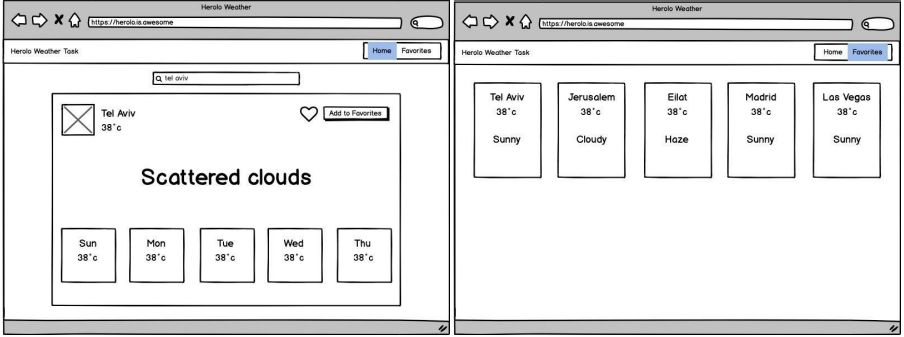
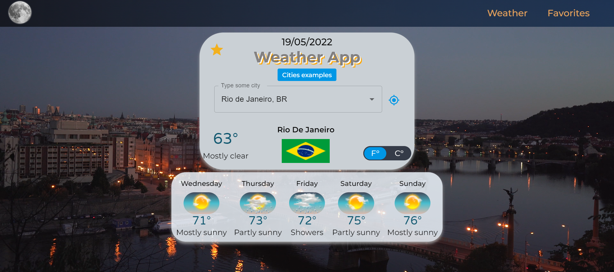
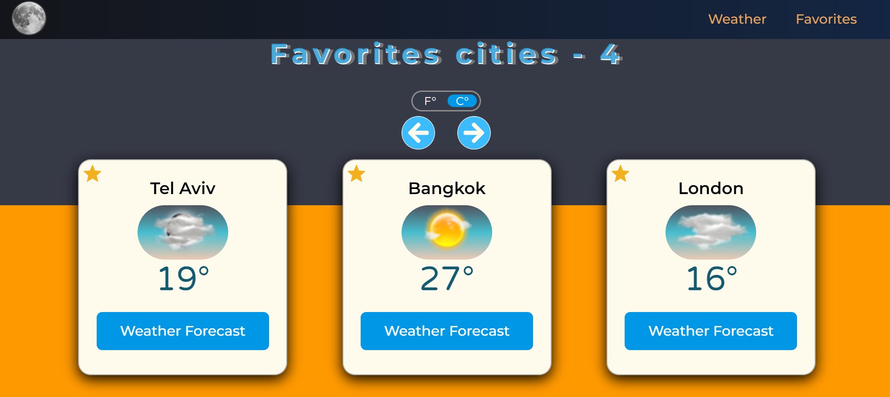

# Weather-App

<!-- PROJECT LOGO -->
 

    

<!-- TABLE OF CONTENTS -->

  
Table of Contents

  <ol>
    <li>
      <ul>
    <li><a href="#assignment">Assignment</a></li>
    <li><a href="#api">API</a></li>
    <li><a href="#goals">Goals</a></li>
    <li><a href="#submission">Submission</a></li>
    <li><a href="#specs">Specs</a></li>
    <li><a href="#bonuses">Bonuses</a></li>
    <li><a href="#example">Example</a></li>
    <li><a href="#solution">Solution</a></li>
        <li><a href="#built-with">Built With</a></li>
          <ul>
        <li><a href="#ide">IDE</a></li>
        <li><a href="#frameworks-platforms-and-libraries">Frameworks, Platforms and Libraries</a></li>
        <li><a href="#languages">Languages</a></li>
        <li><a href="#deployment">Deployment</a></li>
          </ul>        
      </ul>
    </li>
  </ol>

 

(<a href="#top">back to top</a>)

## Assignment

#### Write a simple, responsive, web app in angular/react that shows the weather of some city.

- The user should be able to search for a city and save it to favorites (locally, a server is not required).
- We expect to see 2 pages in this app. (weather page and favorites page).
- We recommend you use a 3rd party UI library (material, prime, bootstrap, etc.)

(<a href="#top">back to top</a>)

## API

- The API that you’ll use for this app is [AccuWeather API](https://developer.accuweather.com). Please sign up and create a new app to get
  an API key.
- You will use 3 endpoints:

- [x] [location autocomplete](https://developer.accuweather.com/accuweather-locations-api/apis/get/locations/v1/cities/autocomplete) for the search field.
- [x] [get current weather](https://developer.accuweather.com/accuweather-current-conditions-api/apis/get/currentconditions/v1/%7BlocationKey%7D) in order to get the current weather.
- [x] [5-day daily forecast](https://developer.accuweather.com/accuweather-forecast-api/apis/get/forecasts/v1/daily/5day/%7BlocationKey%7D) for forecast (Please read those API docs).
  - NOTE: this API is limited to 50 requests per day. our recommendation is to save the responses
    and use them locally during development.

(<a href="#top">back to top</a>)

## Goals

- [x] Show us your coding skills - We want to see your strengths, don’t be afraid to go wild, add
      features and customize the design.
- [x] Readability - Your code should be readable and self-explanatory with minimum
      comments. Remove any unused code, console logs, and files. Use logical project
      structure and code separation.

(<a href="#top">back to top</a>)

<!-- Running-tests-->

## Submission

- [x] Push your code to your git repository and make it public (we recommend GitHub to use
      GitHub Pages with ease), name the repo as firstName-lastName-dateOfStart (JohnDoe-01-12-2018).
- [x] Deploy the compiled app to your server or GitHub pages/Heroku/etc - MUST.

### Send us the git repository link and a link to the deployed app (2 links).

(<a href="#top">back to top</a>)

## Specs

- [x] Create a header with navigation icons/links/buttons for main and favorites screen.
- [x] The main screen (weather details) will be composed of a search field to search a
      location’s weather by city name. And below it, the current weather and a 5-day forecast of
      the searched location. A location should have an indication if it’s already saved in
      favorites, and a button to add/remove from favorites (it can be the same button).
- [x] Display Tel Aviv weather by default.
- [x] Favorites screen will be composed of a list of favorite locations. Each location should
      have an ID, name, and current weather. Clicking on a favorite will navigate to the
      mainscreen showing the details of that location.
- [x] Searching should be done in English letters only
- [x] State management is a must!
- [x] Responsive design is a must! (flexbox/grid will give you extra points😉).
- [x] Error handling is a must! (Can be done with toast, modal).

(<a href="#top">back to top</a>)

## Bonuses

- [x] Set the default location by using the [Geolocation API](https://developer.mozilla.org/en-US/docs/Web/API/Geolocation_API). you will need another API
      endpoint for this: [get location key by lat/lon](https://developer.accuweather.com/accuweather-locations-api/apis/get/locations/v1/cities/geoposition/search).
- [x] Add Celsius/Fahrenheit toggle button.
- [x] Add animations (with good taste).
- [ ] Add dark/light theme support (add toggle button in the header).

(<a href="#top">back to top</a>)

## Example

- We’ve created a UI mockup, so you’ll have a basic idea of what we expect to see.

(<a href="#top">back to top</a>)

## Solution

#### Weather Page

#### Favorites Page

(<a href="#top">back to top</a>)

### Built With

- #### IDE

  [![Vscode][vscode-shield]][vscode-url]

- #### Frameworks, Platforms and Libraries

  [![AWS][aws-shield]][aws-url]
  [![React][react-shield]][react-url]
  [![Redux][redux-shield]][redux-url]
  [![ReactRouter][react-router-shield]][react-router-url]
  [![Npm][npm-shield]][npm-url]
  [![Nodejs][nodejs-shield]][nodejs-url]
  [![Css3][css3-shield]][css3-url]
  [![SASS][sass-shield]][sass-url]
  [![StyledComponent][styled-component-shield]][styled-component-url]
  [![Mui][mui-shield]][mui-url]

- #### Languages

  [![Html5][html5-shield]][html5-url]
  [![JavaScript][javascript-shield]][javascript-url]

(<a href="#top">back to top</a>)

- #### Deployment
- [x] [Weather-App](http://accuweather-app.s3-website.us-east-2.amazonaws.com/)

(<a href="#top">back to top</a>)

<!-- Badges -->

<!-- build with -->

<!-- IDE -->

[vscode-url]: https://code.visualstudio.com/
[vscode-shield]: https://img.shields.io/badge/Visual_Studio_Code-0078D4?style=for-the-badge&logo=visual%20studio%20code&logoColor=white

<!-- Frameworks -->
<!-- Nodejs -->

[nodejs-url]: https://nodejs.org/en/
[nodejs-shield]: https://img.shields.io/badge/Node.js-339933?style=for-the-badge&logo=nodedotjs&logoColor=whit

<!-- Npm -->

[npm-url]: https://www.npmjs.com/
[npm-shield]: https://img.shields.io/badge/npm-CB3837?style=for-the-badge&logo=npm&logoColor=white

<!-- Aws-->

[aws-shield]: https://img.shields.io/badge/AWS-%23FF9900.svg?style=for-the-badge&logo=amazon-aws&logoColor=white
[aws-url]: https://aws.amazon.com/

<!--React  -->

[react-shield]: https://img.shields.io/badge/React-20232A?style=for-the-badge&logo=react&logoColor=61DAFB
[react-url]: https://reactjs.org/

<!--Redux  -->

[redux-shield]: https://img.shields.io/badge/redux-%23593d88.svg?style=for-the-badge&logo=redux&logoColor=white
[redux-url]: https://redux.js.org/

<!--React-router  -->

[react-router-shield]: https://img.shields.io/badge/React_Router-CA4245?style=for-the-badge&logo=react-router&logoColor=white
[react-router-url]: https://reactrouter.com/

<!-- Mui -->

[mui-shield]: https://img.shields.io/badge/MUI-%230081CB.svg?style=for-the-badge&logo=material-ui&logoColor=white
[mui-url]: https://mui.com/

<!-- Sass -->

[sass-shield]: https://img.shields.io/badge/SASS-hotpink.svg?style=for-the-badge&logo=SASS&logoColor=white
[sass-url]: https://sass-lang.com/

<!-- Styled component -->

[styled-component-shield]: https://img.shields.io/badge/styled--components-DB7093?style=for-the-badge&logo=styled-components&logoColor=white
[styled-component-url]: https://styled-components.com/

<!-- Css3 -->

[css3-shield]: https://img.shields.io/badge/css3-%231572B6.svg?style=for-the-badge&logo=css3&logoColor=white
[css3-url]: https://en.wikipedia.org/wiki/CSS

<!-- Languages -->

<!-- Html5-->

[html5-url]: https://developer.mozilla.org/en-US/docs/Glossary/HTML5
[html5-shield]: https://img.shields.io/badge/HTML5-E34F26?style=for-the-badge&logo=html5&logoColor=white

<!-- JavaScript -->

[javascript-url]: https://developer.mozilla.org/en-US/docs/Web/JavaScript
[javascript-shield]: https://img.shields.io/badge/JavaScript-323330?style=for-the-badge&logo=javascript&logoColor=F7DF1E
